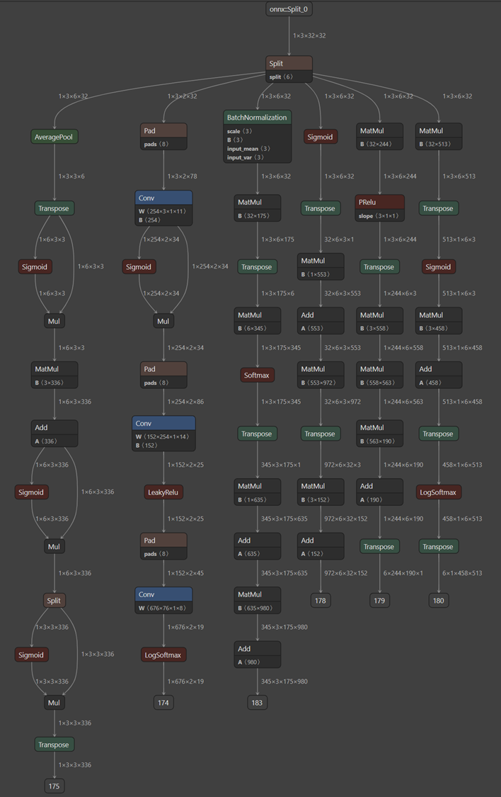
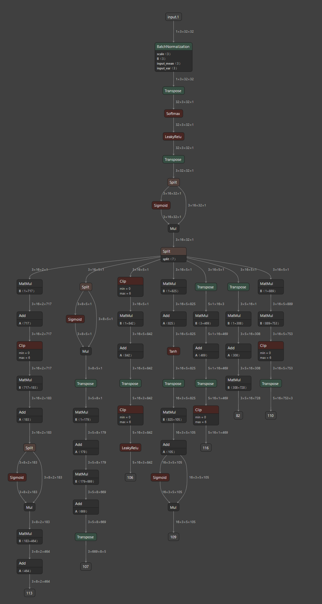

# 🧠 Random Neural Architecture Search (RNAS)

This repository introduces **Random Neural Architecture Search (RNAS)** — a novel approach to generating diverse neural network architectures **randomly**, unlike traditional NAS methods that rely on manually defined blocks and fixed connection patterns.

RNAS aims to explore a wider architectural space by leveraging randomness, promoting diversity, and potentially discovering innovative model structures that may be overlooked by conventional design strategies.

---

## 📊 Sample Results

Below are example outputs generated by RNAS:

---

## 🚧 Upcoming Features

- Code to reproduce the architectures  
- Visualization tools  
- Benchmarking results  
- Integration with training pipelines  

---

Feel free to open issues or contribute to help improve this project!
