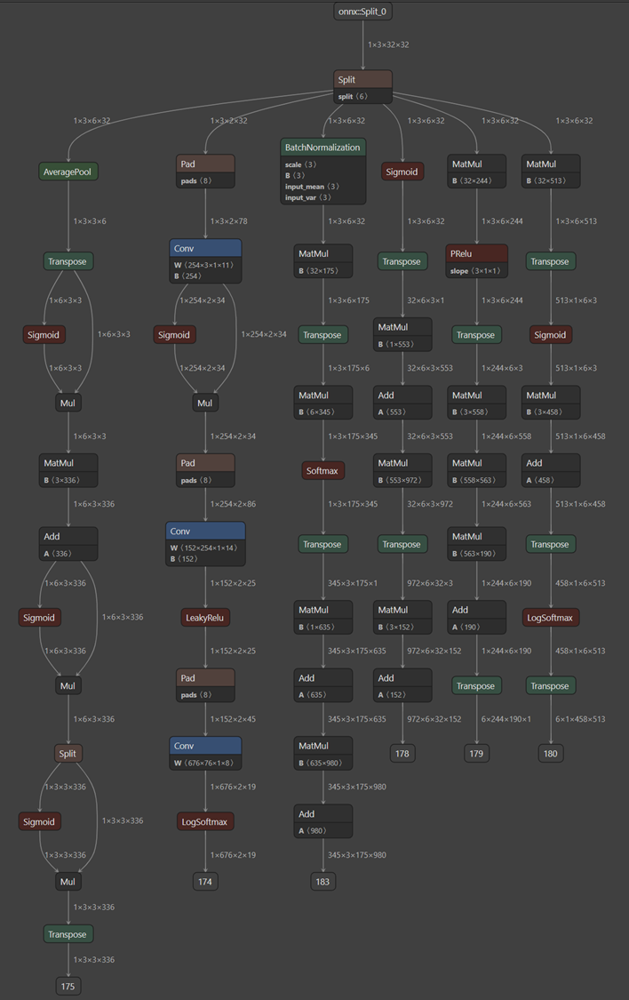
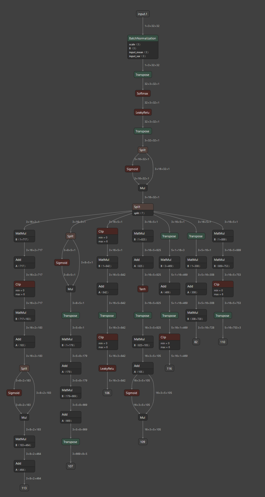

# Random Neural Architecture Search (RNAS)
This repository is to generate diverse neural architecture randomly instead of traditional NAS which is pre-defined a block and its connection manually. 

The different results as following,

